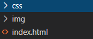

# Maquetación de portafolio en HTML Y CSS  

Para iniciar, debemos de crear un fichero html y un css, podemos poner separado el fichero css del html, poniendo el css dentro de una carpeta, al igual que otros recursos que vayamos a necesitar como el caso de las imagenes, como se muestra en la siguiente imagen.

  

Una vez creado los ficheros y carpetas, vamos a crear todo el documento html, sin importar el diseño, ya que se hará después con css, primero tenemos el head de un documento html, lo que sale al inicio es la especificación del tipo de documento, pero éste aparece cuando ponemos y damos tab para que se cree y quede de la siguiente manera el documento html.<pre>html:5</pre>
``` 
<!DOCTYPE html>
<html lang="en">
<head>
    <meta charset="UTF-8">
    <meta name="viewport" content="width=device-width, initial-scale=1.0">
    <title>Document</title>
</head>
<body>
    
</body>
</html>
```
``` 
<!DOCTYPE html>
```
Especifica el tipo de documento.
``` 
<html lang="en">

```
Lang es para el idioma, está en ingles si en vez de la "n" cambiamos  a "s" indicamos que es español y de paso se abre la etiqueta html que indica inicio del documento.
``` 
<head>
    <meta charset="UTF-8">
    <meta name="viewport" content="width=device-width, initial-scale=1.0">
    <title>Document</title>
</head>

```  
El head, es la parte inicial, no se va a mostrar nada ya que dentro del head llamamos a los ficheros css, además ponemos el título de la página que saldrá en la pestaña cuando la abramos en el navegador, meta charset indica los caracteres que permite el documento, en este caso el UTF-8 acepta todos los tipos de caracteres.  
``` 
<body>
    
</body>
</html>
```
La etiqueta body indica el cuerpo del documento, dentro del body escribiremos las etiquetas con información que será mostrada en el navegador, y la etiqueta de cierre de html que indica el fin del documento.  
  
  ## Para la creación del body del portafolio vamos a usar las siguientes etiquetas  
  * header
  * img 
  * div 
  * section
  * table
  * etiquetas de título (h1 ... h6)
  * footer  
  * nav  
  En el header podemos poner algún título del portafólio o un menú de navegación.  
### HTML
``` 
 <header id="inicio">
        <nav id="nav">
            <a id="a" href="#inicio">Inicio</a>
            <a id="a" href="#exper">Experiencias</a>
            <a id="a" href="#datos">Datos adicionales</a>
            <a id="a" href="#rec">Recomendaciones</a>
        </nav>
    </header>
```  
### CSS usado  
<pre> #inicio{
    margin-top: -10px;
    position: fixed;
    width: 100%;
    height: 50px;
    background-color: rgb(19, 17, 17);
    margin-left: -10px;
    padding:10px;
    text-align: right;
}
#nav{
    margin-top: 10px;
}
#a{
    color: white;
    font-size: 20px;
    margin: 5px;
    border-radius: 2px;
}
#a:hover{
    background-color: rgb(100, 100, 99);
    animation-delay: 30ms;
}
</pre>
### Resultado
  
Luego puse una imágen como eslogan y un título que dijera algo sobre que trata el portafolio, que sería información sobre mi, de manera digital.  

  
Luego, cree un section para mostrar en una tabla mis experiencias y direcciones de algunos repositorios.  

### HTML  
```
    <section>
        <details>
            <legend><b>Experiencias</b></legend>
            <summary>
            </summary>
            <table id="tabla">
                <tr>
                    <th id="th">PROYECTO</th>
                    <th id="th">DESCRIPCIÓN</th>
                </tr>
                <tr>
                    <th id="first">SEMNI</th>
                    <th>Creación de mi primer proyecto de escritorio, para registro de matriculas de instituto secundario.</th>
                </tr>
                <tr>
                    <th id="first">PLATAFORMA PARA LA VIDA</th>
                    <th>Creación de una plataforma para curso y empleos para personas con discapacidades.</th>
                </tr>
                <tr>
                    <th id="first">MAYTRAD</th>
                    <th>Creación de un diccionario/traductor del idioma mayangna a español y de español a mayangna.</th>
                </tr>
                <tr>
                    <th id="first">PUNTO DE VENTA</th>
                    <th>Desarrollo de sistema para pulperias, con registro de compras, ventas y créditos.</th>
                </tr>
                <tr id="first">
                    <th>ALCALDÍA</th>
                    <th>Desarrollo de sistema de registro civil de las personas, en la alcadía de Siuna.</th>
                </tr>
            </table>

            <h2 id="h2b">Repositorios GitHub de algunos proyectos.</h2>
            <nav>
                <div id="contend">
                    <div class="tarjeta">
                        <div id="ig-tar">
                            
                        </div>
                        <a href="https://github.com/HenryDiaz1202/MAYTRAD.git">MAYTRAD</a>
                    </div>
    
                    <div class="tarjeta1">
                        <div id="ig-tar">
                            
                        </div>
                        <a href="https://github.com/HenryDiaz1202/PlataformaSinBarreras.git">Plataforma para la vida</a>
                    </div>
    
                    <div class="tarjeta2">
                        <div id="ig-tar">
                            
                        </div>
                        <a href="https://github.com/HenryDiaz1202/PuntoVenta.git">Punto de venta</a>
                    </div>  
    
                </div>
            </nav>

        </details>
    </section>
```
### CSS usado
<pre>
#h2b{
    text-align: center;
    margin-top: 30px;
    color: rgb(172, 27, 16);
}

#tabla{
    width: 90%;
}
#first{
    text-align: left;
}
#th{
background-color: rgb(65, 173, 163);
text-align: center;
border-radius: 4px;
color:white;
}
th{
    border-style: solid;
    border-top: none;
    border-left: none;
    border-right: none;
    border-collapse: collapse;
    text-align: left;
    border-width: 1px;
    border-color: rgb(91, 92, 90);
    font-size: 20px;
    color: rgb(59, 58, 58);
}
#contend{
    width: 80%;
    margin-bottom: 120px;
}
.tarjeta{
    background-color: rgb(219, 219, 219);
    margin: 10px;
    width:400px;
    height:290px;
    border-radius: 30px;
    text-align: center;
    font-size: 25px;
    float: left;
}
.tarjeta1{
    background-color: rgb(219, 219, 219);
    margin: 10px;
    width:400px;
    height:290px;
    border-radius: 30px;
    text-align: center;
    font-size: 25px;
    float: right;
}
.tarjeta2{
    background-color: rgb(219, 219, 219);
    margin: 10px;
    width:400px;
    height:290px;
    border-radius: 30px;
    text-align: center;
    font-size: 25px;
    margin: 0 auto;
    margin-top: 10px;
}
#ig-tar{
    width: 100%;
    margin-left: -10px;
    margin-top: -10px;
}
a{
    color: black;
}
#h2b{
    text-align: center;
    margin-top: 30px;
    color: rgb(172, 27, 16);
}
</pre>  
### Resultado  

  

Para los datos adicionales sólo usé una lista dentro de un section.

### HTML  
```
<h2 id="datos">Datos adicionales</h2>
    <section>
        <details>
            <legend><b>Datos</b></legend>
            <div id="lista">
                <li>Participación en Rally Latino Americano de Innovación 2019.</li>
                <li>Participación en curso de Open Innovation Garage</li>
                <li>Participación en curso de robótica con tetrix en la URACCAN</li>
                <li>Participación en curso de robótica con lego en la URACCAN </li>
                <li>Participación en primera temporada de innovación en la URACCAN</li>
            </div>
            <summary>
            </summary>
        </details>
    </section>
```
### CSS usado
<pre>
#lista{
    width: 50%;
    font-size: 20px;
    text-align: left;
}
</pre>
### Resultado  
 

Finalmente llegamos a las recomendaciones.
### HTML  
```
<h2 id="rec">Recomendaciones</h2>
    <section>
        <details>
            <legend><b>Recomendaciones</b></legend>
            <div id="parr">
                <p>Participar en comunidades de programación o tecnología, ayudan a pensar diferente las cosas y compartir conocimientos.</p>
                <p>Tener más participación en eventos tecnológicos en los centros de estudio.</p>
                <p>Aprender sobre las nuevas tecnologías, ya que dia a dia se van actualizando.</p>
                <p>No detener el aprendizaje, cada día hay que aprender cosas nuvas, por muy sencillas que sean, especialmente en el área tecnológica e innovación.</p>
            </div>
            <summary id="">
            </summary>
        </details>
    </section>
```
### CSS usado
<pre>
#parr{
    width: 50%;
    font-size: 20px;
    text-align: left;
}
</pre> 
### Resultado
  
### HTML  
```
 <footer id="footer">
        <label for="">Todos los derechos reservados HenryDanielDíaz.O. <br>henrydiaz1202@gmail.com</label>
    </footer>
```
### CSS usado
<pre>
#footer{
    background-color: rgb(19, 17, 17);
    width: 100%;
    height: 50px;
    background-color: rgb(19, 17, 17);
    margin-left: -10px;
    padding:10px;
    color: white;
    text-align: center;
    margin-top: 20px;
}
</pre>
### Resultado
  
Este ha sido todo el código usado para la creación del portafolio.